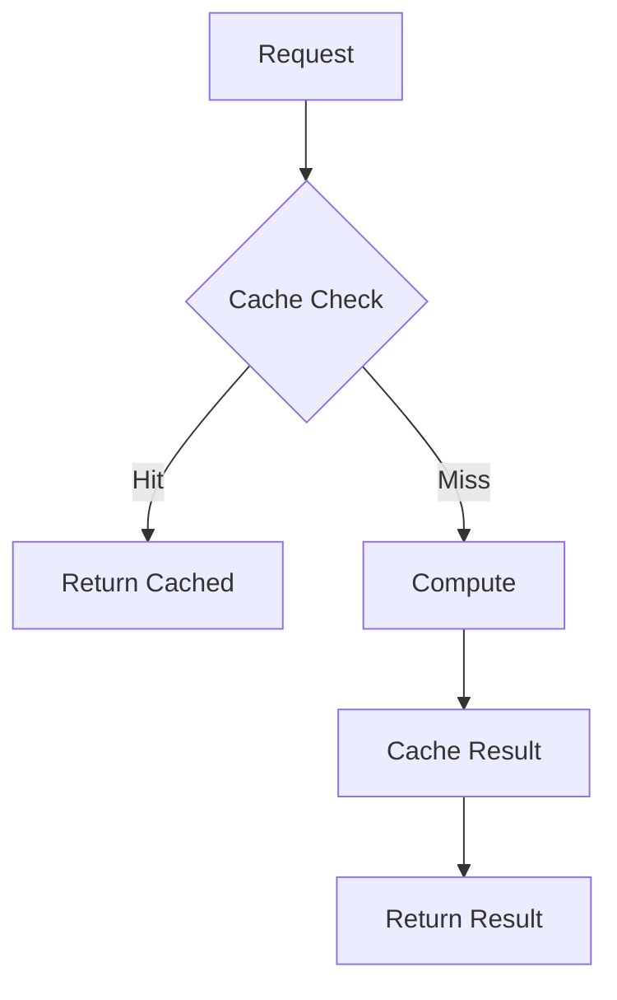
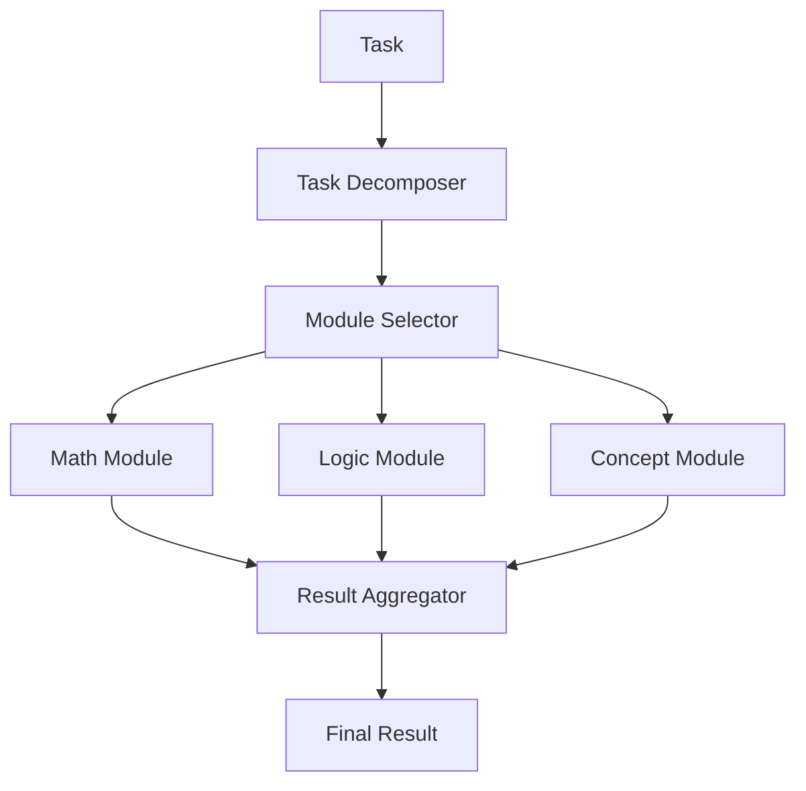
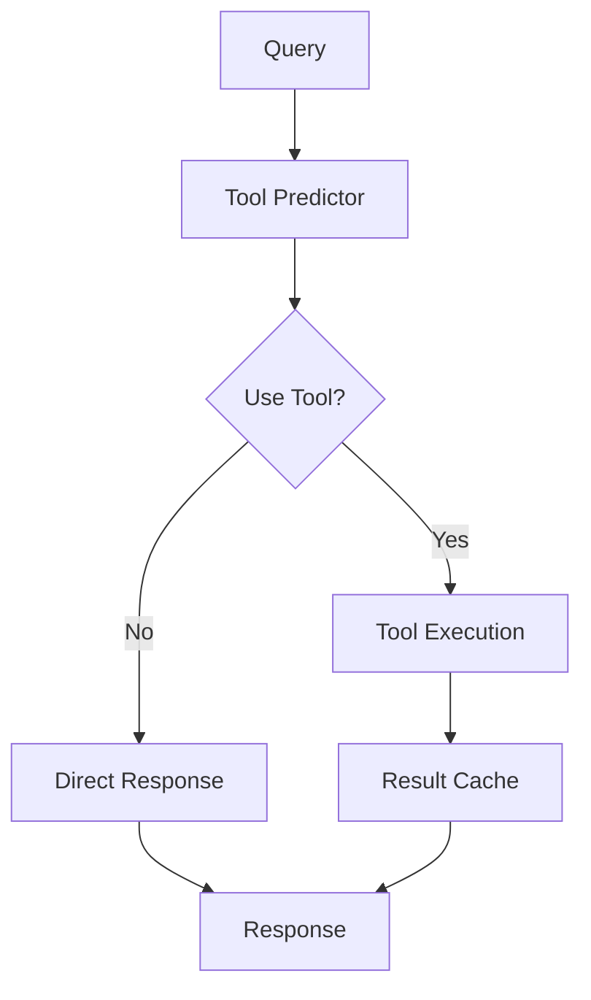
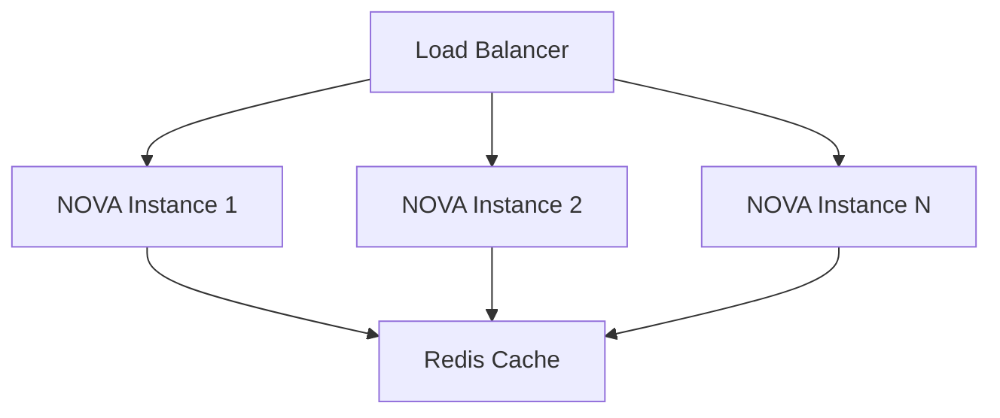

# NOVA Technical Specification: Performance Improvements

## System Architecture

### 1. Caching Layer


#### Components
- **Cache Manager**
  - LRU implementation
  - TTL management
  - Distributed cache support (Redis)
  - Metrics collection

#### Interface
```python
class ICacheManager:
    async def get(key: str) -> Optional[Any]
    async def set(key: str, value: Any, ttl: int = 3600) -> None
    async def invalidate(key: str) -> None
    def get_metrics() -> Dict[str, float]
```

### 2. Hierarchical Chain-of-Thought


#### Components
- **Task Decomposer**
  - Pattern recognition
  - Dependency analysis
  - Priority assignment

- **Reasoning Modules**
  - Specialized algorithms
  - Domain-specific knowledge
  - Performance optimizations

#### Interface
```python
class IReasoningModule:
    async def process(task: Task) -> Result
    def get_capabilities() -> List[str]
    def estimate_complexity(task: Task) -> float
```

### 3. Model Optimization

#### Quantization Pipeline


#### Components
- **Model Manager**
  - Weight quantization
  - Mixed precision
  - Performance monitoring

#### Interface
```python
class IOptimizedModel:
    async def infer(input: Tensor) -> Tensor
    def get_memory_usage() -> int
    def get_performance_metrics() -> Dict[str, float]
```

### 4. Tool Integration

#### Architecture


#### Components
- **Tool Predictor**
  - Usage statistics
  - Cost analysis
  - Performance tracking

#### Interface
```python
class IToolPredictor:
    async def should_use_tool(query: str, tool: str) -> bool
    def update_statistics(tool: str, success: bool) -> None
    def get_tool_metrics() -> Dict[str, float]
```

## Implementation Requirements

### 1. Performance Targets
- Response Time: < 500ms for cached results
- Memory Usage: < 2GB per instance
- Cache Hit Rate: > 80%
- Tool Prediction Accuracy: > 95%

### 2. System Requirements
- Python 3.10+
- Redis 6.0+ for distributed caching
- CUDA 11.0+ for GPU acceleration
- 8GB+ RAM per instance
- SSD storage for model weights

### 3. Dependencies
```toml
[dependencies]
redis = "^4.0.0"
torch = "^2.0.0"
bitsandbytes = "^0.4.0"
transformers = "^4.30.0"
httpx = "^0.24.0"
pydantic = "^2.0.0"
```

### 4. Configuration
```yaml
cache:
  type: "redis"
  ttl: 3600
  max_size: "2GB"

model:
  quantization: "int8"
  device: "cuda"
  batch_size: 32

reasoning:
  modules: ["math", "logic", "concept"]
  max_depth: 5
  timeout: 30

tools:
  prediction_threshold: 0.95
  max_retries: 3
  timeout: 10
```

## Monitoring and Metrics

### 1. Performance Metrics
- Response times (p50, p95, p99)
- Memory usage
- Cache hit rates
- Model inference times
- Tool usage statistics

### 2. Quality Metrics
- Reasoning accuracy
- Tool prediction precision
- Cache freshness
- Error rates

### 3. Resource Metrics
- CPU utilization
- GPU memory usage
- Network bandwidth
- Disk I/O

## Testing Strategy

### 1. Unit Tests
```python
class TestCacheManager:
    async def test_cache_hit()
    async def test_cache_miss()
    async def test_ttl_expiration()

class TestReasoningModules:
    async def test_task_decomposition()
    async def test_module_selection()
    async def test_result_aggregation()
```

### 2. Integration Tests
- End-to-end reasoning flows
- Cache synchronization
- Tool interaction patterns
- Error handling scenarios

### 3. Performance Tests
- Load testing
- Stress testing
- Endurance testing
- Recovery testing

## Deployment

### 1. Infrastructure


### 2. Scaling Strategy
- Horizontal scaling based on load
- Cache replication
- Model sharding
- Tool load balancing

### 3. Monitoring Setup
- Prometheus metrics
- Grafana dashboards
- Alert configurations
- Log aggregation

## Security Considerations

### 1. Data Protection
- Encryption at rest
- Secure communication
- Access control
- Audit logging

### 2. Model Security
- Input validation
- Output sanitization
- Rate limiting
- Version control

This technical specification provides a detailed blueprint for implementing the proposed improvements to the NOVA system. It covers architecture, requirements, monitoring, testing, deployment, and security considerations.