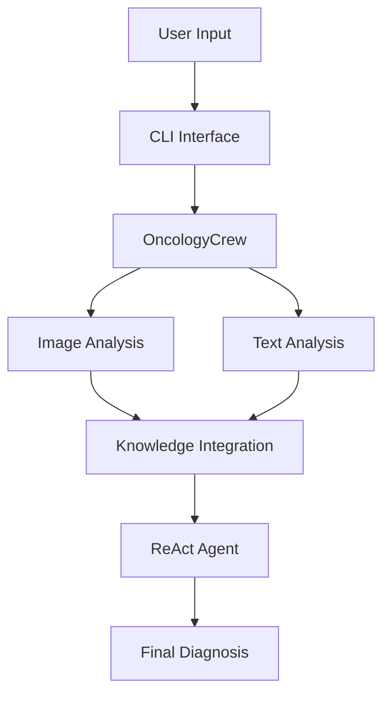

# Oncology Detection System: System Overview

## Introduction

The Oncology Detection System is a DSPy-based implementation that combines multi-modal analysis (medical images and clinical reports) with a ReAct agent for cancer detection. This system leverages NOVA's infrastructure while adding specialized medical analysis capabilities.

## System Architecture

### High-Level Components

1. **Core Engine**
   - DSPy-based ReAct agent
   - Multi-modal analysis pipeline
   - Knowledge integration system

2. **Analysis Modules**
   - Image Analysis Module (medical imaging)
   - Text Analysis Module (clinical reports)
   - Knowledge Base Module (medical guidelines)

3. **Infrastructure Components** (reused from NOVA)
   - Caching System
   - Progress Tracking
   - Error Handling
   - CLI Interface

### Component Interaction Flow

## Key Features

1. **Multi-Modal Analysis**
   - Concurrent processing of images and text
   - Modality-specific preprocessing
   - Cross-modal validation

2. **Intelligent Reasoning**
   - Step-by-step analysis via ReAct
   - Evidence-based decision making
   - Uncertainty quantification

3. **Medical Knowledge Integration**
   - Clinical guidelines enforcement
   - Symptom-diagnosis mapping
   - Validation against known patterns

4. **Performance Optimization**
   - Caching of analysis results
   - Efficient resource utilization
   - Response streaming

## System Requirements

### Software Dependencies
- Python 3.8+
- DSPy framework
- PyTorch (for image analysis)
- Transformers (for text analysis)
- NOVA base system

### Hardware Requirements
- CPU-only operation supported
- Minimum 8GB RAM
- 10GB disk space

### External Services
- OpenRouter API access
- (Optional) Cloud storage for model weights

## Integration with NOVA

### Reused Components
1. **Cache System**
   - Response caching
   - Metrics tracking
   - Encryption support

2. **Progress Tracking**
   - Step-by-step monitoring
   - Status updates
   - Error reporting

3. **CLI Framework**
   - Command parsing
   - Option handling
   - User interaction

### Extended Components
1. **Reasoning System**
   - Added medical specialization
   - Multi-modal support
   - Oncology-specific prompts

2. **Tool Interface**
   - Medical image analysis
   - Clinical text processing
   - Knowledge base queries

## Security and Privacy

1. **Data Protection**
   - Encrypted caching
   - Secure API communication
   - PHI/PII handling

2. **Access Control**
   - Role-based access
   - Audit logging
   - Session management

3. **Compliance**
   - HIPAA considerations
   - FDA guidelines
   - Medical device regulations

## Next Steps

1. **Implementation Phase 1**
   - Core DSPy integration
   - Basic image/text analysis
   - CLI adaptation

2. **Implementation Phase 2**
   - Advanced medical analysis
   - Knowledge base integration
   - Performance optimization

3. **Implementation Phase 3**
   - Testing and validation
   - Documentation completion
   - Deployment preparation

## References

1. NOVA Base System
2. DSPy Framework
3. ReAct Pattern
4. Medical Imaging Standards
5. Clinical NLP Guidelines